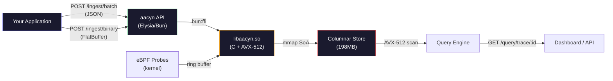

# aacyn Quickstart

Deploy self-hosted observability in 5 minutes.

aacyn is free and open source under the Apache 2.0 license. No license key, no registration, no phone-home.

---

## Prerequisites

| Requirement | Why |
|---|---|
| Linux x86_64 (Ubuntu 22.04+, Debian 12+) | AVX-512 SIMD + eBPF require modern Linux |
| [Bun](https://bun.sh) >= 1.1 | Runtime for the API control plane |
| A C compiler (`gcc` or `clang`) | Compiles the native columnar store |
| 512 MB free RAM | Stores 16M events in mmap'd memory |

```bash
# Verify prerequisites
uname -m          # expect: x86_64
bun --version     # expect: 1.x
gcc --version     # expect: any version
```

> **What if it fails?** If `uname -m` returns `aarch64`, you're on ARM — aacyn runs but without AVX-512 SIMD acceleration (falls back to NEON). If `bun` is not found, install it: `curl -fsSL https://bun.sh/install | bash`

---

## Step 1: Download and Build

```bash
# Clone and build
git clone https://github.com/aacyn/aacyn.git
cd aacyn

# Build the native columnar store
just build-native
```

**Expected output:**
```
libaacyn build complete
  Platform: Linux/x86_64
  Library:  ../build/libaacyn.so
  CFLAGS:   -O3 ... -mavx512f -mavx512bw -mavx512vl
```

> **What if it fails?** If you see `error: unrecognized command-line option '-mavx512f'`, your CPU doesn't support AVX-512. Edit `native/Makefile` and remove the `-mavx512*` flags — the store will still work, just without SIMD-accelerated scans.

---

## Step 2: Start the Server

```bash
cd ts/apps/api
bun install
bun run src/index.ts
```

**Expected output:**
```
[libaacyn] Native store initialized: 16,000,000 capacity, 198.4MB mmap'd
[aacyn] Native FFI store active — V8 GC bypassed
aacyn API running at http://localhost:3001
```

> **What if it fails?**
> - `Native store unavailable, using V8 Map fallback` — Run `just build-native` first. The server will still work but without SIMD acceleration.
> - `EADDRINUSE` — Port 3001 is in use. Set a different port: `PORT=3002 bun run src/index.ts`

**Health check (in another terminal):**
```bash
curl -s http://localhost:3001/health | jq .
```

**Expected response:**
```json
{
  "status": "ok",
  "version": "1.0.0-dev",
  "uptime": 1234
}
```

> **What if it fails?** If `curl` returns `Connection refused`, the server isn't running. Check the terminal where you started it for error messages.

---

## Step 3: Send Your First Events

aacyn accepts telemetry via HTTP POST. Here's how to send events from your application:

### JSON Batch Ingestion

This is the simplest integration path. Send an array of RED (Rate/Error/Duration) metric events:

```bash
curl -X POST http://localhost:3001/ingest/batch \
  -H "Content-Type: application/json" \
  -d '{
    "events": [
      {
        "traceId": "abc-123",
        "service": "payment-api",
        "durationMs": 42.5,
        "isError": false,
        "timestamp": 1710000000000
      },
      {
        "traceId": "def-456",
        "service": "payment-api",
        "durationMs": 1250.0,
        "isError": true,
        "timestamp": 1710000001000
      }
    ]
  }'
```

**Expected response (HTTP 202):**
```json
{
  "accepted": 2,
  "timestamp": 1710000002000
}
```

> **Why 202?** The events are accepted for processing, not synchronously committed. This allows the native store to batch writes for maximum throughput. Under normal operation, events are available for query within 1ms.

### Event Schema

| Field | Type | Required | Description |
|-------|------|----------|-------------|
| `traceId` | string | Yes | Unique identifier for the trace/request |
| `service` | string | Yes | Name of the originating service (e.g., `payment-api`) |
| `durationMs` | number | Yes | Request duration in milliseconds |
| `isError` | boolean | Yes | Whether this event represents an error |
| `timestamp` | number | Yes | Unix epoch milliseconds |

---

## Step 4: Query Your Data

Retrieve events by trace ID:

```bash
curl -s http://localhost:3001/query/trace/abc-123 | jq .
```

**Expected response:**
```json
{
  "traceId": "abc-123",
  "service": "payment-api",
  "durationMs": 42.5,
  "isError": false,
  "timestamp": 1710000000000
}
```

> **What if it returns 404?** The trace ID doesn't exist in the store. Double-check the ID you sent in Step 3. IDs are case-sensitive.

---

## Step 5: Instrument Your Application

### Node.js / TypeScript

```typescript
// aacyn-client.ts — Drop this into any Node.js service
const AACYN_URL = process.env.AACYN_URL || "http://localhost:3001";
const SERVICE_NAME = process.env.SERVICE_NAME || "my-service";

interface AacynEvent {
  traceId: string;
  service: string;
  durationMs: number;
  isError: boolean;
  timestamp: number;
}

// Buffer events and flush every 100ms for efficiency
let buffer: AacynEvent[] = [];
let flushTimer: NodeJS.Timeout | null = null;

export function trackRequest(traceId: string, durationMs: number, isError = false) {
  buffer.push({
    traceId,
    service: SERVICE_NAME,
    durationMs,
    isError,
    timestamp: Date.now(),
  });

  // Auto-flush when buffer reaches 100 events or after 100ms
  if (buffer.length >= 100) flush();
  else if (!flushTimer) {
    flushTimer = setTimeout(flush, 100);
  }
}

async function flush() {
  if (buffer.length === 0) return;
  const events = buffer;
  buffer = [];
  if (flushTimer) { clearTimeout(flushTimer); flushTimer = null; }

  try {
    await fetch(`${AACYN_URL}/ingest/batch`, {
      method: "POST",
      headers: { "Content-Type": "application/json" },
      body: JSON.stringify({ events }),
    });
  } catch (err) {
    // aacyn is down — events are lost, but your service keeps running.
    // This is intentional: observability should never break your app.
    console.warn(`[aacyn] flush failed: ${(err as Error).message}`);
  }
}

// Flush remaining events on shutdown
process.on("beforeExit", flush);
```

**Usage in an Express/Hono/Elysia handler:**
```typescript
import { trackRequest } from "./aacyn-client";
import { randomUUID } from "crypto";

app.get("/checkout", async (req, res) => {
  const traceId = randomUUID();
  const start = performance.now();

  try {
    const result = await processCheckout(req);
    trackRequest(traceId, performance.now() - start, false);
    res.json(result);
  } catch (err) {
    trackRequest(traceId, performance.now() - start, true);
    res.status(500).json({ error: "Internal error" });
  }
});
```

### Python

```python
# aacyn_client.py
import requests, time, threading, uuid, os

AACYN_URL = os.getenv("AACYN_URL", "http://localhost:3001")
SERVICE_NAME = os.getenv("SERVICE_NAME", "my-service")

_buffer = []
_lock = threading.Lock()

def track_request(trace_id: str, duration_ms: float, is_error: bool = False):
    """Record a request event. Non-blocking, batched automatically."""
    with _lock:
        _buffer.append({
            "traceId": trace_id,
            "service": SERVICE_NAME,
            "durationMs": duration_ms,
            "isError": is_error,
            "timestamp": int(time.time() * 1000),
        })
        if len(_buffer) >= 100:
            _flush()

def _flush():
    global _buffer
    if not _buffer:
        return
    events, _buffer = _buffer, []
    try:
        requests.post(f"{AACYN_URL}/ingest/batch",
                      json={"events": events}, timeout=1)
    except Exception as e:
        pass  # Observability should never crash your app

# Usage:
# trace_id = str(uuid.uuid4())
# start = time.time()
# ... your logic ...
# track_request(trace_id, (time.time() - start) * 1000, is_error=False)
```

### Go

```go
// aacyn.go
package aacyn

import (
    "bytes"
    "encoding/json"
    "net/http"
    "os"
    "sync"
    "time"
)

var (
    aacynURL    = envOr("AACYN_URL", "http://localhost:3001")
    serviceName = envOr("SERVICE_NAME", "my-service")
    mu          sync.Mutex
    buffer      []map[string]interface{}
)

func TrackRequest(traceID string, durationMs float64, isError bool) {
    mu.Lock()
    defer mu.Unlock()
    buffer = append(buffer, map[string]interface{}{
        "traceId":    traceID,
        "service":    serviceName,
        "durationMs": durationMs,
        "isError":    isError,
        "timestamp":  time.Now().UnixMilli(),
    })
    if len(buffer) >= 100 {
        go flush()
    }
}

func flush() {
    mu.Lock()
    if len(buffer) == 0 { mu.Unlock(); return }
    events := buffer
    buffer = nil
    mu.Unlock()

    body, _ := json.Marshal(map[string]interface{}{"events": events})
    http.Post(aacynURL+"/ingest/batch", "application/json", bytes.NewReader(body))
}

func envOr(key, fallback string) string {
    if v := os.Getenv(key); v != "" { return v }
    return fallback
}
```

---

## Architecture Overview



**Data flow:** Your application sends events via HTTP -> Elysia validates and passes the pointer via `bun:ffi` -> the C library writes directly into mmap'd memory (zero-copy) -> AVX-512 SIMD scans the columnar store for queries. No intermediate databases, no disk I/O on the hot path, no garbage collection.

---

## Troubleshooting

### Server won't start

| Symptom | Cause | Fix |
|---------|-------|-----|
| `dlopen: libaacyn.so not found` | Native store not compiled | `just build-native` |
| `EADDRINUSE: port 3001` | Port in use | `PORT=3002 bun run src/index.ts` |
| `V8 Map fallback` warning | `libaacyn.so` not in `build/` | `just build-native` |

### Events not appearing in queries

| Symptom | Cause | Fix |
|---------|-------|-----|
| `accepted: 0` | Empty events array | Ensure `events` is a non-empty array |
| HTTP 422 | Schema validation fail | Check that all 5 required fields are present and correctly typed |
| `trace_not_found` (404) | Wrong trace ID | IDs are case-sensitive; verify with the ID from the ingest response |

---

## Production Checklist

- [ ] Run with `sudo` if eBPF probes are needed (optional)
- [ ] Set up a systemd unit for auto-restart on crash
- [ ] Configure firewall to restrict port 3001 to your internal network
- [ ] Point your application's `AACYN_URL` to the appliance IP

---

## What's Next

- **Binary ingestion** for 5M+ events/sec (see `docs/binary-protocol.md`)
- **eBPF probes** for zero-instrumentation kernel telemetry (see `docs/ebpf.md`)
- **WebGPU dashboard** for real-time topology visualization at `http://localhost:3000`
- **Grafana plugin** for alerting and custom dashboards
- **Golden Signals** — automatic rate, error, duration metrics per discovered service

Questions or feedback? Open an issue on GitHub or reach out to the community.
