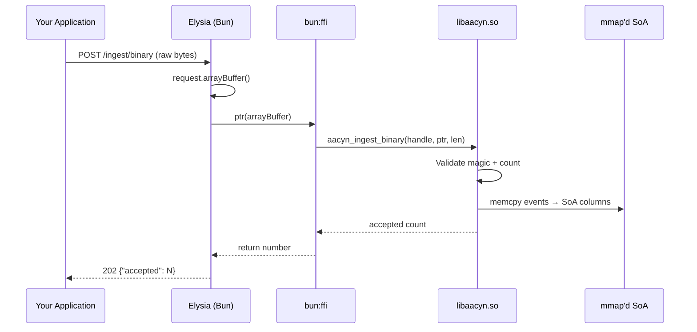

# aacyn Binary Ingestion Protocol

> **Performance:** 5.09M events/sec with 16ms p99 latency — 16× faster than JSON ingestion.
>
> Use this protocol when JSON parsing overhead is unacceptable. The binary path achieves zero-parse, zero-copy ingestion by passing a raw memory pointer from Bun directly into the C columnar store via `bun:ffi`.

---

## When to Use Binary vs JSON

| | JSON (`/ingest/batch`) | Binary (`/ingest/binary`) |
|---|---|---|
| **Throughput** | ~314K events/sec | 5.09M events/sec |
| **Latency (p99)** | ~219ms | 16ms |
| **Integration effort** | Drop-in HTTP POST | Requires FlatBuffer tooling |
| **Use case** | Application telemetry | High-frequency infrastructure metrics, log pipelines |

> **Rule of thumb:** If you're ingesting < 100K events/sec, use JSON. It's simpler and fast enough. Switch to binary when you're pushing the limits.

---

## Wire Format

The binary protocol uses [FlatBuffers](https://google.github.io/flatbuffers/) for zero-copy serialization. Each payload is a `TelemetryBatch` containing an array of fixed-size event records.

### Event Record Layout

Each event is exactly **16 bytes** in the wire format:

```
Offset  Size  Type    Field
──────  ────  ──────  ─────────────
0       8     u64     timestamp (Unix epoch ms)
8       4     f32     durationMs
12      2     u16     flags (bit 0 = isError)
14      2     u16     padding (alignment)
```

> **Why 16 bytes?** Cache-line aligned. On modern CPUs, 16B events fit exactly 4 per cache line (64B), maximizing L1/L2 cache efficiency during SIMD scans.

### Batch Header

```
Offset  Size  Type    Field
──────  ────  ──────  ─────────────
0       4     u32     magic (0xAACE0001)
4       4     u32     event_count
8       N×16  bytes   event_records[]
```

**Total payload size:** `8 + (event_count × 16)` bytes

---

## Generating Binary Payloads

### Using the Bundled Generator

```bash
cd /opt/aacyn
bun run benchmarks/generate_payload.ts
```

**Expected output:**
```
FlatBuffer Payload Generated
  Events:   100
  Bytes:    1656 (1.62 KB)
  Output:   benchmarks/payload.bin
```

### Sending a Binary Payload

```bash
curl -X POST http://localhost:3001/ingest/binary \
  -H "Content-Type: application/octet-stream" \
  --data-binary @benchmarks/payload.bin
```

**Expected response (202):**
```json
{
  "accepted": 100,
  "timestamp": 1710000002000,
  "mode": "binary"
}
```

> **What if it fails?**
> - `400 Buffer too small` → Payload must be ≥ 8 bytes (header only = 8 bytes)
> - `501 Binary ingestion requires native store` → Run `just build-native` first

### Building Your Own Payload (Node.js)

```typescript
function buildBinaryPayload(events: Array<{timestamp: number, durationMs: number, isError: boolean}>): Buffer {
  const MAGIC = 0xAACE0001;
  const headerSize = 8;
  const eventSize = 16;
  const buf = Buffer.alloc(headerSize + events.length * eventSize);

  // Header
  buf.writeUInt32LE(MAGIC, 0);
  buf.writeUInt32LE(events.length, 4);

  // Events
  for (let i = 0; i < events.length; i++) {
    const offset = headerSize + i * eventSize;
    buf.writeBigUInt64LE(BigInt(events[i].timestamp), offset);
    buf.writeFloatLE(events[i].durationMs, offset + 8);
    buf.writeUInt16LE(events[i].isError ? 1 : 0, offset + 12);
    buf.writeUInt16LE(0, offset + 14); // padding
  }

  return buf;
}

// Usage
const payload = buildBinaryPayload([
  { timestamp: Date.now(), durationMs: 42.5, isError: false },
  { timestamp: Date.now(), durationMs: 1250, isError: true },
]);

await fetch("http://localhost:3001/ingest/binary", {
  method: "POST",
  headers: { "Content-Type": "application/octet-stream" },
  body: payload,
});
```

### Building Your Own Payload (Python)

```python
import struct
import requests

def build_binary_payload(events):
    """Build an aacyn binary payload from a list of event dicts."""
    MAGIC = 0xAACE0001
    header = struct.pack("<II", MAGIC, len(events))
    body = b"".join(
        struct.pack("<QfHH",
            event["timestamp"],
            event["duration_ms"],
            1 if event.get("is_error") else 0,
            0  # padding
        )
        for event in events
    )
    return header + body

payload = build_binary_payload([
    {"timestamp": 1710000000000, "duration_ms": 42.5, "is_error": False},
    {"timestamp": 1710000001000, "duration_ms": 1250.0, "is_error": True},
])

requests.post(
    "http://localhost:3001/ingest/binary",
    data=payload,
    headers={"Content-Type": "application/octet-stream"},
)
```

---

## How It Works Internally



**Key insight:** There is no serialization/deserialization step. The raw bytes from the HTTP request body are passed as a pointer directly to the C function, which copies them into the mmap'd columnar store. This is why binary ingestion is 16× faster than JSON.
