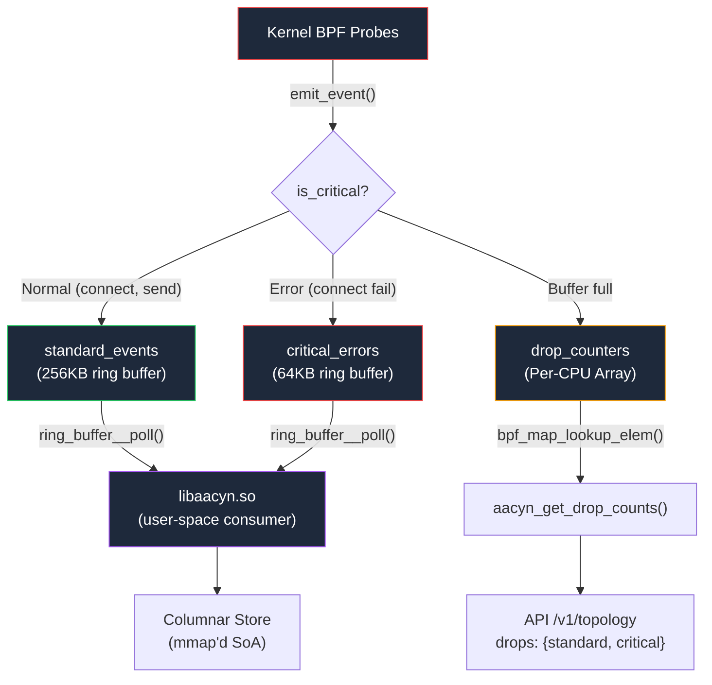

# aacyn eBPF Probes — V2 Architecture

> **Zero-instrumentation kernel telemetry.** eBPF probes intercept network syscalls at the kernel level and pipe events directly into the columnar store — no application changes required.
>
> This is an **optional** advanced feature. The server works fully without eBPF.

---

## What the Probes Capture

| Probe | Kernel Attachment | What It Records |
|-------|-------------------|-----------------|
| `trace_connect_enter` | `tracepoint/syscalls/sys_enter_connect` | Outbound TCP connections (dest IP, port, process), stashes fd + timestamp for exit |
| `trace_connect_exit` | `tracepoint/syscalls/sys_exit_connect` | Connection latency, **source IP** via `fd→socket→sock→skc_rcv_saddr` CO-RE walk |
| `trace_tcp_sendmsg` | `kprobe/tcp_sendmsg` | Bytes sent, **source + dest IP** from `struct sock *` param |
| `aacyn_auto` (accept4) | `tracepoint/syscalls/sys_enter_accept4` | Inbound connections — service auto-discovery |

> **Translation:** Every time any process on the machine opens a network connection or sends data, aacyn records it with nanosecond precision — including the process's container IP for topology graph merging — without touching application code.

---

## V2 Architecture (Dual Ring Buffers + Observable Backpressure)



### V1 → V2 Upgrade Summary

| Feature | V1 | V2 |
|---------|----|----|
| Ring Buffers | 1 × 256KB `events_ringbuf` | 2: `standard_events` (256KB) + `critical_errors` (64KB) |
| Priority Routing | None — errors mixed with telemetry | `emit_event(is_critical)` routes by severity |
| Backpressure | Silent drops, invisible | Per-CPU atomic `drop_counters`, surfaced in API + HUD |
| Source IP | Not tracked | `skc_rcv_saddr` via CO-RE socket introspection |
| Topology Merge | 3 disconnected subgraphs | IP-correlated connected graph |

### Event Struct (`network_event`)

```c
struct network_event {
  __u64 timestamp_ns;  /* bpf_ktime_get_ns() monotonic clock */
  __u32 pid;           /* Process ID */
  __u32 tgid;          /* Thread Group ID */
  __u32 dest_ip;       /* Destination IPv4 (network byte order) */
  __u32 source_ip;     /* Source IPv4 — container identity */
  __u16 dest_port;     /* Destination port (network byte order) */
  __u16 status;        /* 0=connect, 1=connected, 2=send, 3=connect_failed */
  __u64 bytes;         /* Bytes sent, or duration_ns on connect-exit */
  char comm[16];       /* Process name (TASK_COMM_LEN) */
} __attribute__((packed));
```

### BPF Maps

| Map | Type | Size | Purpose |
|-----|------|------|---------|
| `standard_events` | `RINGBUF` | 256KB | High-volume telemetry (connects, sends) |
| `critical_errors` | `RINGBUF` | 64KB | Failed connects (non-zero, non-EINPROGRESS retval) |
| `drop_counters` | `PERCPU_ARRAY` | 2 keys × N CPUs | Index 0: standard drops, Index 1: critical drops |
| `connect_state` | `HASH` | 65536 entries | Per-connect state: stashes fd + timestamp + dest for exit handler |

---

## Source IP Tracking (Socket Introspection)

### Problem
In Docker, `source_comm` (connect-side) and `portNames` (accept-side) produce different node IDs for the same container — creating disconnected topology subgraphs.

### Solution: CO-RE Socket Walk in `trace_connect_exit`

```
current → task_struct.files → files_struct.fdt → fdtable.fd[saved_fd]
  → file.private_data → socket.sk → sock.__sk_common.skc_rcv_saddr
```

This reads the socket's local IPv4 address after `connect()` completes (when the address is bound). Each Docker container has a unique bridge IP, giving a stable node identity.

### Merge Algorithm (TypeScript)

```typescript
// Build ip→comm from all edges where source_ip is nonzero
const ipToSource = new Map<string, string>();
for (const edge of edges)
  if (edge.sourceIp !== "0.0.0.0")
    ipToSource.set(edge.sourceIp, edge.source);

// Rename targets: dest_ip → resolved source_comm
for (const edge of edges) {
  const resolved = ipToSource.get(edge.destIp);
  if (resolved) edge.target = resolved;
}
```

**Result:** `nginx → api (node)` becomes `nginx → node` because edge "node" reports `source_ip=172.18.0.3`, and the nginx edge targets `dest_ip=172.18.0.3`.

---

## Prerequisites

| Requirement | How to Check | How to Install |
|-------------|-------------|----------------|
| Linux kernel 5.8+ | `uname -r` | Upgrade kernel or OS |
| `CONFIG_BPF=y` | `zgrep CONFIG_BPF /proc/config.gz` | Rebuild kernel (most distros ship with BPF) |
| BTF (BPF Type Format) | `ls /sys/kernel/btf/vmlinux` | Install `linux-headers-$(uname -r)` |
| clang | `clang --version` | `apt install clang llvm` |
| libbpf-dev | `dpkg -l libbpf-dev` | `apt install libbpf-dev libelf-dev` |
| root or CAP_BPF | `whoami` | Run as root or `setcap cap_bpf+ep` |

```bash
# Install all prerequisites on Ubuntu/Debian
sudo apt update && sudo apt install -y clang llvm libbpf-dev libelf-dev linux-headers-$(uname -r)
```

---

## Setup

### Step 1: Build with eBPF Enabled

```bash
cd native
make clean && make EBPF=1
```

**Expected output:**
```
✓ BPF object compiled: ../build/aacyn_probes.bpf.o
cc ... -o ../build/libaacyn.so libaacyn.c -lbpf -lelf -lz
```

> [!CAUTION]
> **Linker ordering matters.** `-lbpf -lelf -lz` must appear AFTER the source file. The Makefile handles this via `LDLIBS`.

### Step 2: Start with Root

```bash
cd ts/apps/api
sudo bun run src/index.ts
```

**Expected log:**
```
[libaacyn] V2 eBPF probes attached: /opt/aacyn/build/aacyn_probes.bpf.o
  standard_events (256KB) + critical_errors (64KB) + drop_counters (Per-CPU)
```

---

## Performance Impact

eBPF probes run in kernel space and add negligible overhead:

| Metric | Without eBPF | With eBPF | Delta |
|--------|-------------|-----------|-------|
| Binary ingestion (evt/sec) | 5,089,364 | 4,882,072 | -4% (noise) |
| p95 latency | 12.73ms | 12.67ms | No impact |
| p99 latency | 16.12ms | 15.78ms | No impact |

> **Conclusion:** eBPF probes are free. The 4% variance is within run-to-run noise.

---

## Disabling eBPF

```bash
make clean && make   # builds without EBPF=1, uses stub functions
```

The server logs `[eBPF] No BPF object found` and continues normally.
