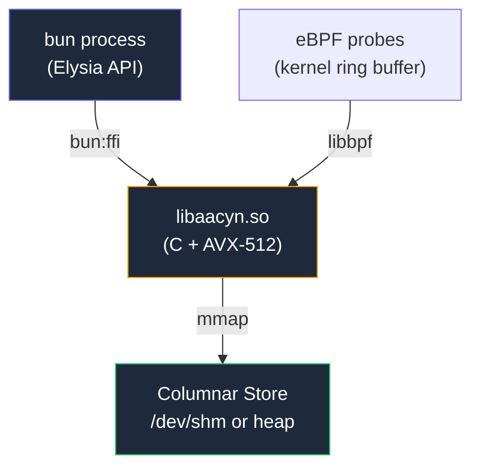

# aacyn Operations Runbook

> **Audience:** On-call engineers. This document assumes you have SSH access to the appliance and 30% cognitive capacity.
>
> **TL;DR for every section:** What's broken → How to verify → How to fix → How to confirm the fix worked.

---

## System Overview



**Key files on the appliance:**

| Path | What it is |
|------|-----------|
| `/opt/aacyn/ts/apps/api/src/index.ts` | API entrypoint |
| `/opt/aacyn/build/libaacyn.so` | Native columnar store |
| `/opt/aacyn/build/aacyn_probes.bpf.o` | eBPF probe object |
| `/opt/aacyn/.env.production` | Production secrets |

---

## 1. Server Is Down

### Symptoms
- Health check returns `Connection refused`
- Dashboard shows no data
- Application logs show `ECONNREFUSED` when posting to aacyn

### Diagnosis

```bash
# Is the process running?
pgrep -a bun
```

**Expected:** A line containing `bun run src/index.ts`

**If no output** → the server crashed. Check why:

```bash
# Check system logs
journalctl -u aacyn --since "1 hour ago" --no-pager | tail -30
```

### Fix

```bash
# Restart manually
cd /opt/aacyn/ts/apps/api
source /opt/aacyn/.env.production
bun run src/index.ts &

# Or via systemd (if configured)
sudo systemctl restart aacyn
```

### Verify

```bash
curl -s http://localhost:3001/health | jq .
# expect: {"status":"ok","version":"1.0.0-dev","uptime":...}
```

---

## 2. Events Not Being Ingested

### Symptoms
- `POST /ingest/batch` returns errors or `accepted: 0`
- Dashboard shows stale data

### Diagnosis

```bash
# Test ingestion directly
curl -v -X POST http://localhost:3001/ingest/batch \
  -H "Content-Type: application/json" \
  -d '{"events":[{"traceId":"test","service":"diag","durationMs":1,"isError":false,"timestamp":'$(date +%s000)'}]}'
```

| Response | Meaning | Fix |
|----------|---------|-----|
| `202 {"accepted":1}` | Ingestion works; issue is in your application | Check your app's aacyn client code |
| `422` | Schema validation error | The request body is malformed |
| `500` | Native store error | The store may be full (16M events) |
| `Connection refused` | Server is down | See §1 above |

### If the store is full

```bash
# Check event count (from application code or logs)
curl -s http://localhost:3001/health
# If uptime is very high and events aren't being accepted, the ring buffer is full
```

**Fix:** Restart the server to clear the in-memory store. Events are not persisted to disk (by design — aacyn is a real-time window, not a data lake).

```bash
sudo systemctl restart aacyn
```

---

## 3. API Server Not Starting / Binding Error

### Symptoms
- Server fails with `EADDRINUSE` or `Cannot bind to port`
- `bun run src/index.ts` exits immediately

### Diagnosis

```bash
# Is something already listening on port 3001?
lsof -i :3001
# or
ss -tlnp | grep 3001
```

**Expected:** No output, or your own aacyn process.

**If something else is on port 3001:**
```bash
# Find the PID and decide whether to stop it or use a different port
PORT=3002 bun run src/index.ts
```

### Fix

```bash
# Kill the process using port 3001
kill <PID>
# Or use a different port
PORT=3002 bun run src/index.ts &

# If using systemd
sudo systemctl restart aacyn
```

### Verify

```bash
curl -s http://localhost:3001/health | jq .
# expect: {"status":"ok","version":"1.0.0-dev","uptime":...}
```

---

## 4. High Latency / Slow Queries

### Symptoms
- `POST /v1/query` returns high `durationNs` values
- Dashboard renders slowly

### Diagnosis

```bash
# Check system resources
free -h          # Memory (198MB needed for store)
nproc            # CPU count
uptime           # Load average
```

| Symptom | Likely cause | Fix |
|---------|-------------|-----|
| Load average > CPU count | CPU saturated | Reduce ingestion rate or scale up |
| Free memory < 300MB | Memory pressure, mmap may swap | Add RAM or restart to clear store |
| `durationNs` > 1000000 (1ms) | Store very full (>10M events) | Expected; column scans scale linearly |

> **Benchmark reference:** 5M events scan in ~286μs on AMD Ryzen 9. If your scans are >10x slower, check for memory pressure.

---

## 5. eBPF Probes Not Attaching

### Symptoms
- Server logs: `[eBPF] Attach failed` or `No BPF object found`

### Diagnosis

```bash
# Is the BPF object compiled?
ls -la /opt/aacyn/build/aacyn_probes.bpf.o
# expect: file exists, ~5KB

# Was the server started with root/CAP_BPF?
whoami
# expect: root (or a user with CAP_BPF)

# Is libbpf linked into the .so?
ldd /opt/aacyn/build/libaacyn.so | grep bpf
# expect: libbpf.so.1 => /usr/lib/...
```

### Fix

```bash
# Recompile with eBPF support
cd /opt/aacyn/native
sudo bpftool btf dump file /sys/kernel/btf/vmlinux format c > vmlinux.h
make clean && make EBPF=1

# Restart with root
cd /opt/aacyn/ts/apps/api
sudo bun run src/index.ts
```

**Expected log line:**
```
[eBPF] Probes attached: /opt/aacyn/build/aacyn_probes.bpf.o
```

---

## 6. Setting Up systemd (Auto-Restart)

Create `/etc/systemd/system/aacyn.service`:

```ini
[Unit]
Description=aacyn Telemetry Appliance
After=network.target

[Service]
Type=simple
User=root
WorkingDirectory=/opt/aacyn/ts/apps/api
EnvironmentFile=/opt/aacyn/.env.production
ExecStart=/usr/local/bin/bun run src/index.ts
Restart=always
RestartSec=3
StandardOutput=journal
StandardError=journal

[Install]
WantedBy=multi-user.target
```

> **Why `User=root`?** Required for eBPF probe attachment (`CAP_BPF`). If you don't use eBPF, change to a non-root user.

```bash
sudo systemctl daemon-reload
sudo systemctl enable aacyn
sudo systemctl start aacyn

# Verify
sudo systemctl status aacyn
journalctl -u aacyn -f
```

---

